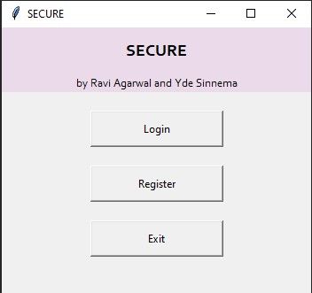
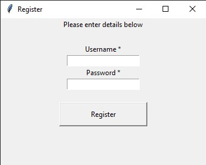
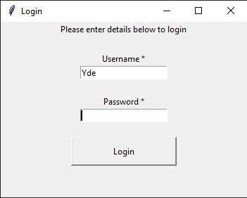
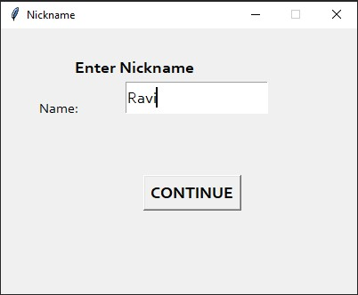
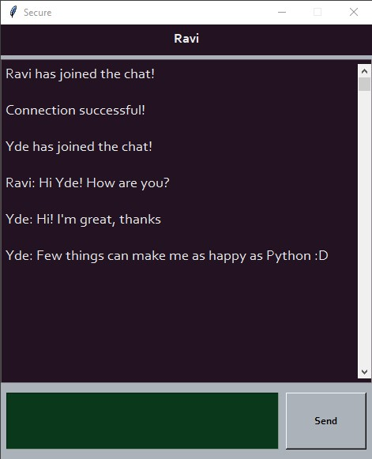

# Secure chatapp

Secure is a messaging application created using Python.
This project was completed in order to pass the course ELEC-H417: "Communication Networks Protocols and Architectures"
taught at the ULB by professor Jean-Michel Dricot.

The goal of this project is to design and implement
a basic chat app enabling private communication.
The application relies on a centralized architecture, 
meaning a central server handles the communication between
clients. The complete architecture
is described in detail in the report.

## Prerequisites

In the source code a couple of external libraries were used.
In order to run the messaging application correctly the following
libraries are necessary. The provided commands should be ran in the terminal.

- rsa 

```
pip install rsa
```
- cryptography

```
pip3 install cryptography
```

## Running the code

To run the code and launch the application, the file server.py should be ran. 
Then client.py needs to be executed on another terminal. This creates a new user. Run client.py again to create another user.
The program has been tested on Windows and other operating systems should not have a problem until python libraries are compatible .

## Features

### General

Upon compilation of the client.py creation of clients is possible.



### Register and login

Registering a new user is done by filling out the fields by clicking "Register".



A user can be logged in by filling out the Username and Password fields by clicking
the login button.



A user has to choose a nickname to be able to chat with other users.



### Sending messages

Once logged in, the user can create a new conversation.
A user can type the message and click on send. 
The message is displayed to other users.



## Contributors

| [Ravi Agarwal](https://github.com/Ravi9742) | [Yde Sinnema](https://github.com/ysinnema) |
|----------------------------------------------------|-------------------------------------------|
